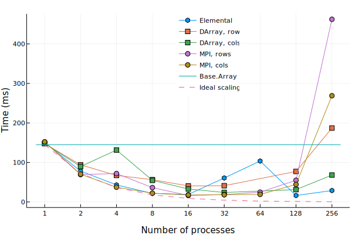
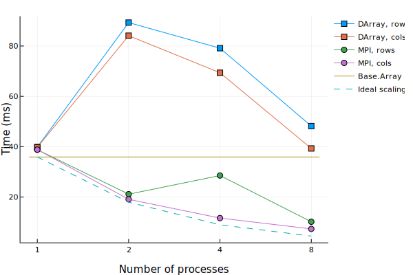

# MPIArrays

This package provides distributed arrays based on MPI one-sided communication primitives.

## Construction

## Manipulation

## Blocks

## Benchmark

As a simple test, the timings of a matrix-vector product were recorded for a range of processes and BLAS threads, and compared to the `Base.Array` and [DistributedArrays.jl](https://github.com/JuliaParallel/DistributedArrays.jl) performance. We also compared the effect of distributing either the rows or the columns. The code for the tests is in `tests/matmul_*.jl`. The results below are for a square matrix of size `N=15000`, using up to 8 machines with 2 Intel E5-2698 v4 CPUs, i.e. 32 cores per machine and using TCP over 10 Gbit ethernet between machines. Using `OPENBLAS_NUM_THREADS=1` and one MPI process per machine this yields the following timings:

The timings using one MPI process per machine and `OPENBLAS_NUM_THREADS=32` are:

Some observations:
1. Using a single process, both `DArray` and `MPIArray` perform at the same level as `Base.Array`, indicating that the overhead of the parallel structures that ultimately wrap a per-process array is negligible. This is reassuring, since just using parallel structures won't slow down the serial case and the code can be the same in all cases.
2. Without threading, the scaling breaks down even before multiple machines come into play. At 256 processes, there is even a severe breakdown of the performance. This may be because each process attempts to communicate with each off-machine process over TCP, rather than pooling the communications between machines. `DArray` seems to tolerate this better than MPI.
3. Using hybrid parallelism, where threads are used to communicate within each machine and MPI or Julia's native parallelism between machines is much faster. For MPI, the scaling is almost ideal with the number of machines, but for `DArray` the results are more erratic.
4. It is better to distribute the matrix columns, at least for this dense matrix matrix-vector product.
5. The `Base.Array` product with `OPENBLAS_NUM_THREADS=32` completes in about 40 ms, while the MPI version on 32 cores on the same machine completes in 18 ms. This suggests there is room for improvement in the threading implementation. On the other hand, the 32 MPI processes are no faster than 16 MPI processes on the same machine, indicating a possible memory bottleneck for this problem.